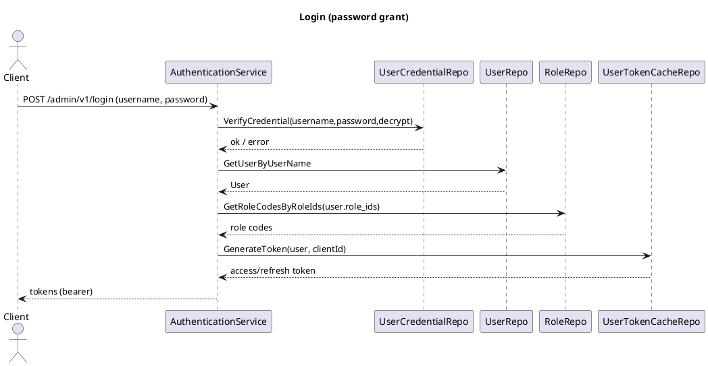
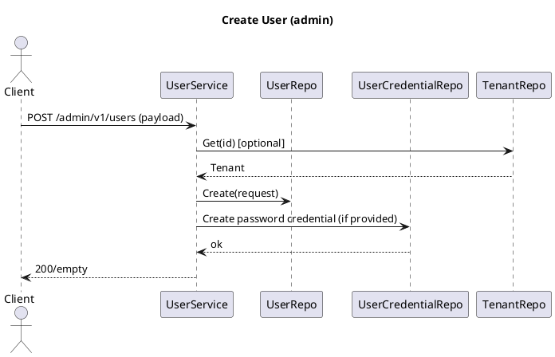
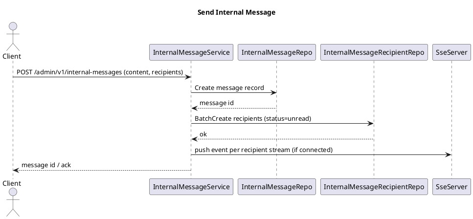

# Admin Service Design (GORM)

## Overview
- **Purpose**: Admin backend built on Kratos with full GORM/Gen data layer and Redis/MinIO integrations.
- **Entry**: `app/admin/service/cmd/server` boots REST + SSE + Asynq via Wire.
- **Transports**: REST with swagger (optional), SSE for push, Asynq for background jobs.
- **Security**: JWT authn (kratos-authn), authz (casbin/OPA/noop) policies generated from roles + API resources.

## Architecture
- **Service layer** (`internal/service`): Protobuf HTTP servers per domain (auth, user, tenant, org/dept/position, role/menu/router/api-resource, dict, file/oss/ueditor, task, internal message, admin logs, login restriction, user profile/credential).
- **Data layer** (`internal/data`): GORM/Gen models + handwritten repositories, Redis token cache, MinIO client, authorizer policy builder, password crypto helper.
- **Server wiring** (`internal/server`): Middleware (logging, op/login log hooks, authn/authz), swagger registration, SSE server, Asynq server with task subscribers.

## Key HTTP Interfaces (from protobuf)
- Auth: `POST /admin/v1/login`, `POST /admin/v1/refresh_token`, `POST /admin/v1/logout`.
- Users: `GET /admin/v1/users`, `GET /admin/v1/users/{id}`, `POST /admin/v1/users`, `PUT /admin/v1/users/{data.id}`, `DELETE /admin/v1/users/{id}`, `POST /admin/v1/users/{user_id}/password`, `POST /admin/v1/users/change-password`, `GET /admin/v1/users_exists`.
- Tenants: CRUD under `/admin/v1/tenants`; create-with-admin handled in service logic.
- Org/Dept/Position: CRUD under `/admin/v1/organizations`, `/admin/v1/departments`, `/admin/v1/positions` with tree/list helpers.
- RBAC: Roles `/admin/v1/roles` (bind menus/apis); Menus `/admin/v1/menus`; Routers `/admin/v1/routers`; API resources `/admin/v1/api-resources`.
- Dict: Dict types `/admin/v1/dict/types`, entries `/admin/v1/dict/entries` (batch delete supported).
- Files: OSS `/admin/v1/oss/files`, generic files `/admin/v1/files`, UEditor uploads `/admin/v1/ueditor`.
- Tasks: `/admin/v1/tasks` CRUD + enable/disable/start/stop; async backup subscriber.
- Internal Message: `/admin/v1/internal-messages` CRUD/send; categories `/admin/v1/internal-message-categories`.
- Admin Ops: `/admin/v1/admin-login-logs`, `/admin/v1/admin-operation-logs`; Login restrictions `/admin/v1/admin-login-restrictions`.

## Data Layer Notes
- GORM/Gen code under `internal/data/gorm`; repositories wrap generated queries.
- `NewGormClient` sets default query client; Redis token cache for JWT/refresh tokens.
- Authorizer rebuilds policies from DB roles + API resources into casbin/OPA engines.
- Password crypto uses bcrypt helper.

## Sequence Sketches (PlantUML)

## Testing Guidance
- Use real configs in `configs/` for integration when possible; Redis/MinIO/DB endpoints must be reachable.
- Run `make test` or `go test ./...` in `backend/app/admin/service` with env pointing to test DB/Redis.
- Swagger UI available when `server.rest.enable_swagger` is true to inspect routes.
