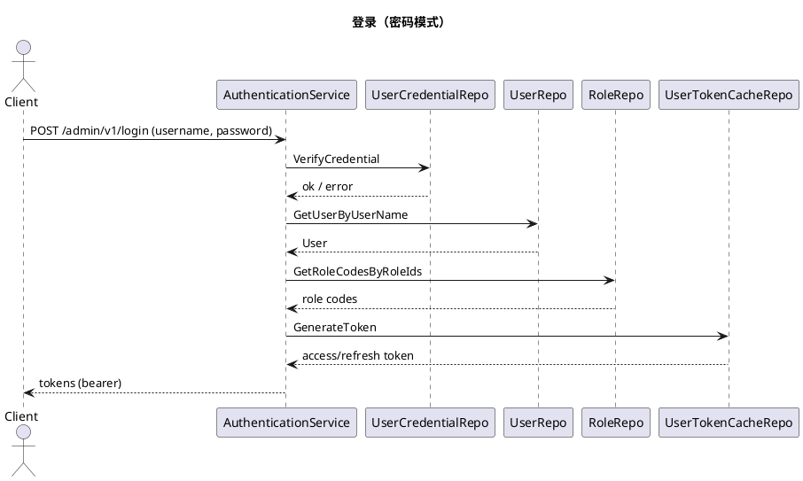
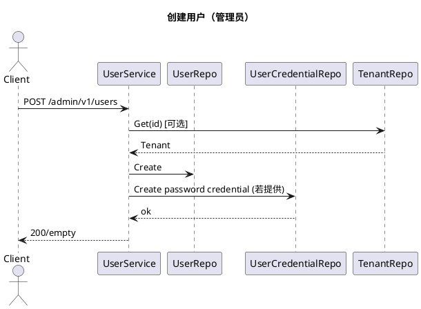
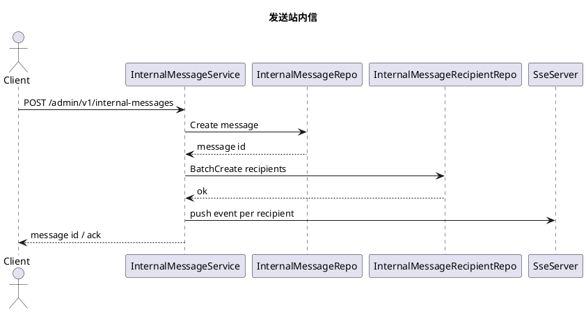

# 管理后台服务设计（GORM）

## 概览
- **定位**：基于 Kratos 的管理后台，数据层全面迁移至 GORM/Gen，配合 Redis、MinIO 等外部依赖。
- **入口**：`app/admin/service/cmd/server` 通过 Wire 启动 REST + SSE + Asynq。
- **传输层**：REST（可选 Swagger）、SSE 推送、Asynq 后台任务。
- **安全**：JWT 认证（kratos-authn），授权引擎支持 casbin/OPA/noop，策略由角色与 API 资源动态生成。

## 架构层次
- **Service 层**（`internal/service`）：按领域提供 protobuf HTTP 服务，涵盖认证、用户、租户、组织/部门/岗位、角色/菜单/路由/API 资源、字典、文件/OSS/UEditor、任务、站内信、后台日志、登录限制、用户档案/凭证等。
- **Data 层**（`internal/data`）：GORM/Gen 模型与手写仓储，Redis 令牌缓存，MinIO 客户端，授权策略构建器，密码加密辅助。
- **Server 装配**（`internal/server`）：中间件（日志、操作/登录日志钩子、认证/鉴权），Swagger 注册，SSE 服务，Asynq 服务与任务订阅。

## 主要 HTTP 接口（源自 protobuf）
- 认证：`POST /admin/v1/login`，`POST /admin/v1/refresh_token`，`POST /admin/v1/logout`
- 用户：`GET /admin/v1/users`，`GET /admin/v1/users/{id}`，`POST /admin/v1/users`，`PUT /admin/v1/users/{data.id}`，`DELETE /admin/v1/users/{id}`，`POST /admin/v1/users/{user_id}/password`，`POST /admin/v1/users/change-password`，`GET /admin/v1/users_exists`
- 租户：`/admin/v1/tenants` CRUD；含创建租户+管理员流程
- 组织/部门/岗位：`/admin/v1/organizations`，`/admin/v1/departments`，`/admin/v1/positions`，支持树/列表
- RBAC：角色 `/admin/v1/roles`（绑定菜单/API），菜单 `/admin/v1/menus`，路由 `/admin/v1/routers`，API 资源 `/admin/v1/api-resources`
- 字典：字典类型 `/admin/v1/dict/types`，字典条目 `/admin/v1/dict/entries`（批量删除）
- 文件：OSS `/admin/v1/oss/files`，通用文件 `/admin/v1/files`，UEditor 上传 `/admin/v1/ueditor`
- 任务：`/admin/v1/tasks` CRUD + 启用/停用/启动/停止，异步备份订阅
- 站内信：`/admin/v1/internal-messages` CRUD/发送；分类 `/admin/v1/internal-message-categories`
- 运维日志：`/admin/v1/admin-login-logs`，`/admin/v1/admin-operation-logs`；登录限制 `/admin/v1/admin-login-restrictions`

## 数据层要点
- GORM/Gen 代码位于 `internal/data/gorm`，仓储对生成查询进行封装。
- `NewGormClient` 设置默认 query 客户端；Redis 缓存 JWT/刷新令牌。
- 授权器从角色与 API 资源重建策略，注入 casbin/OPA 引擎。
- 密码加密使用 bcrypt。

## 时序草图（PlantUML）

## 测试指引
- 尽量使用 `configs/` 中真实配置做集成验证：需要可用的 DB/Redis/MinIO/Asynq。
- 在 `backend/app/admin/service` 下执行 `make test` 或 `go test ./...`，并确保环境变量指向测试资源。
- 若启用 `server.rest.enable_swagger`，可通过 Swagger UI 浏览接口契约。
