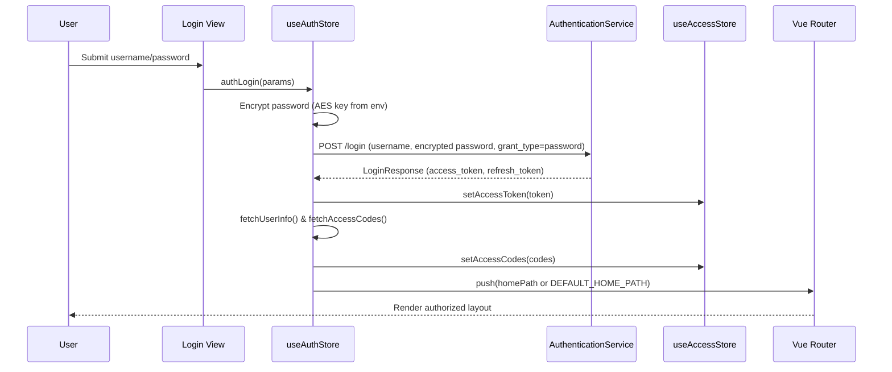
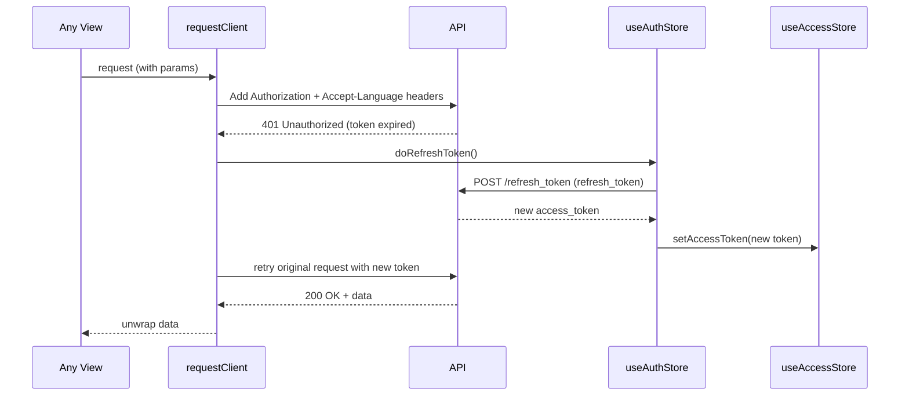

# Sequence Diagrams / 时序图

## Login & Navigation / 登录与跳转

## Protected Request with Refresh / 受保护请求与刷新

## Notes / 说明
- Title auto-updates via `watchEffect` on route meta + app name when `dynamicTitle` enabled.
- Guards verify access codes vs route meta and redirect to `/login` with redirect query when unauthorized.
- Error interceptor surfaces backend messages via `ant-design-vue` `message.error`; customize in `utils/request.ts`.
